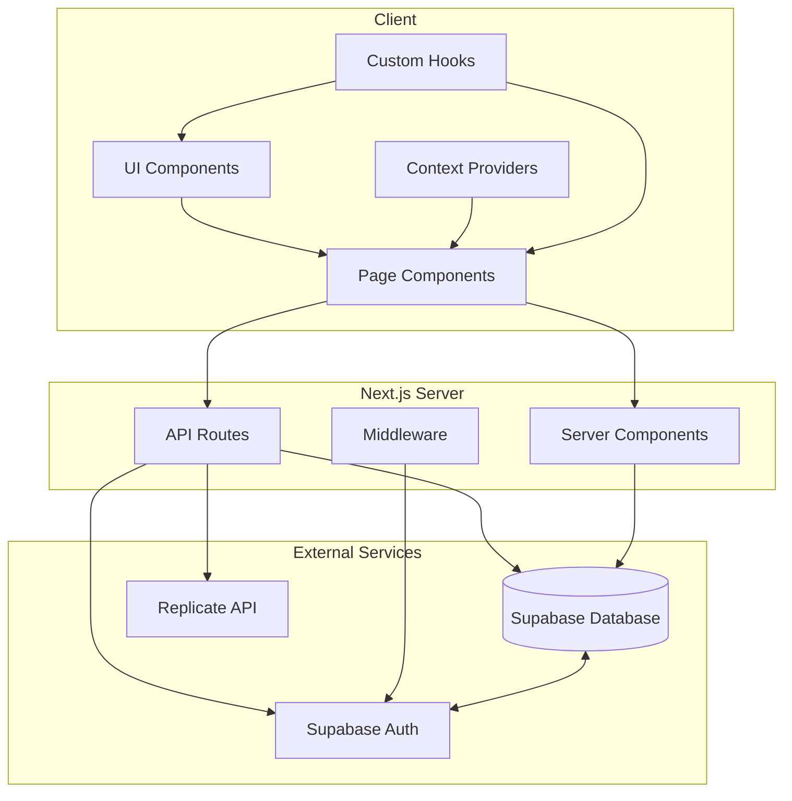
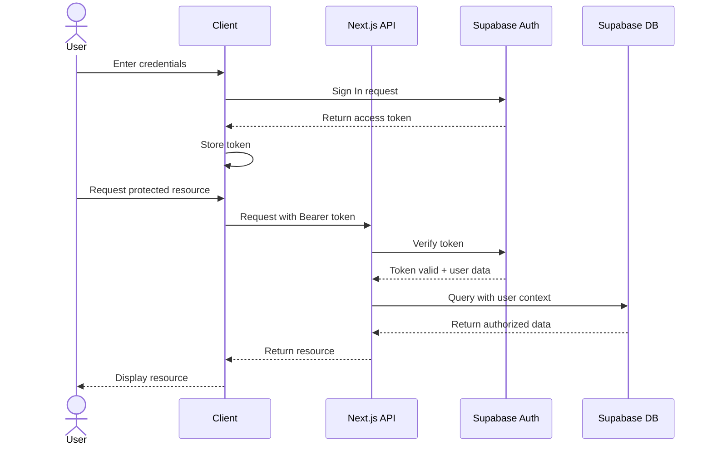
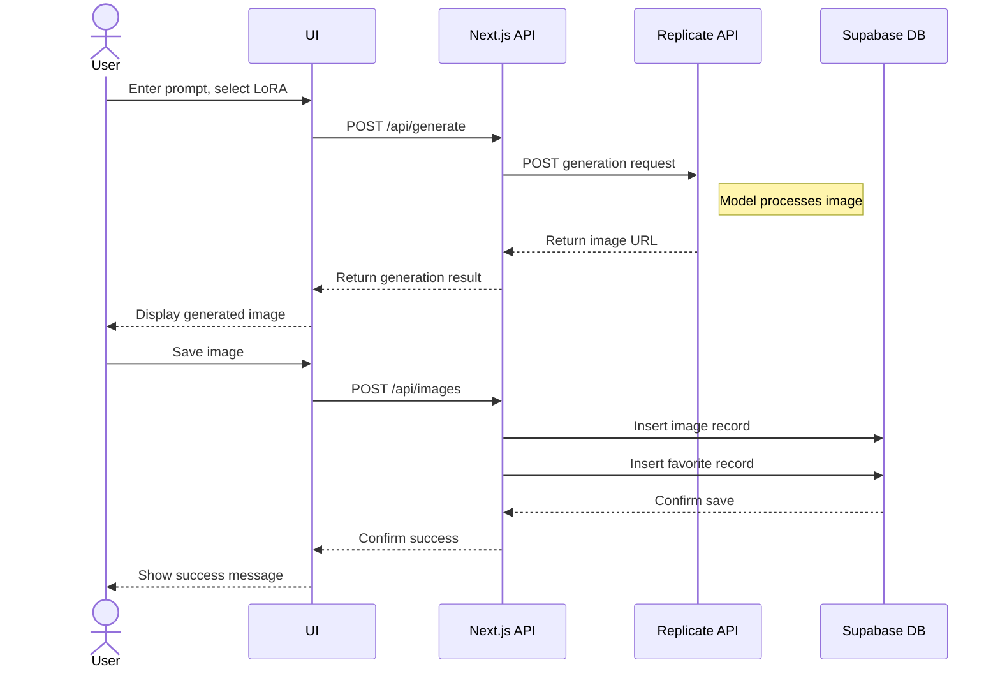
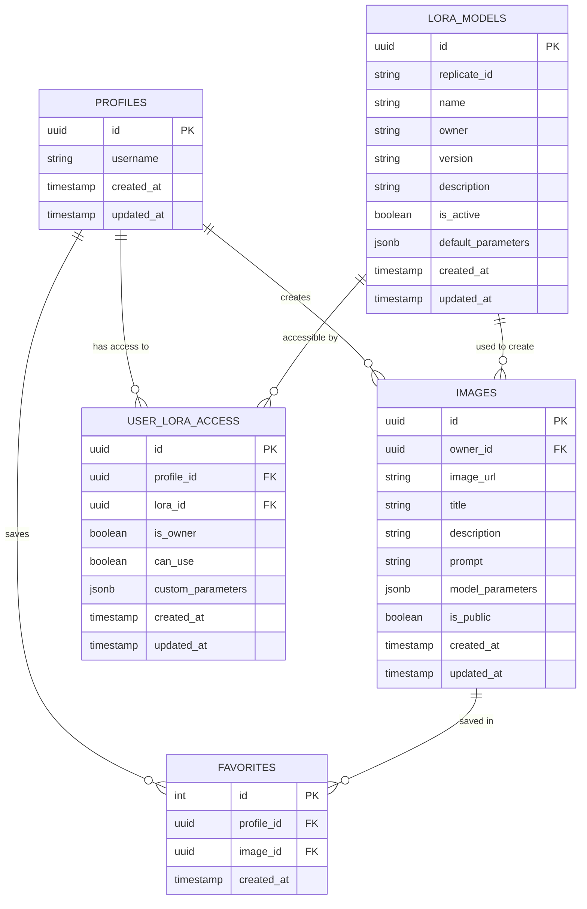
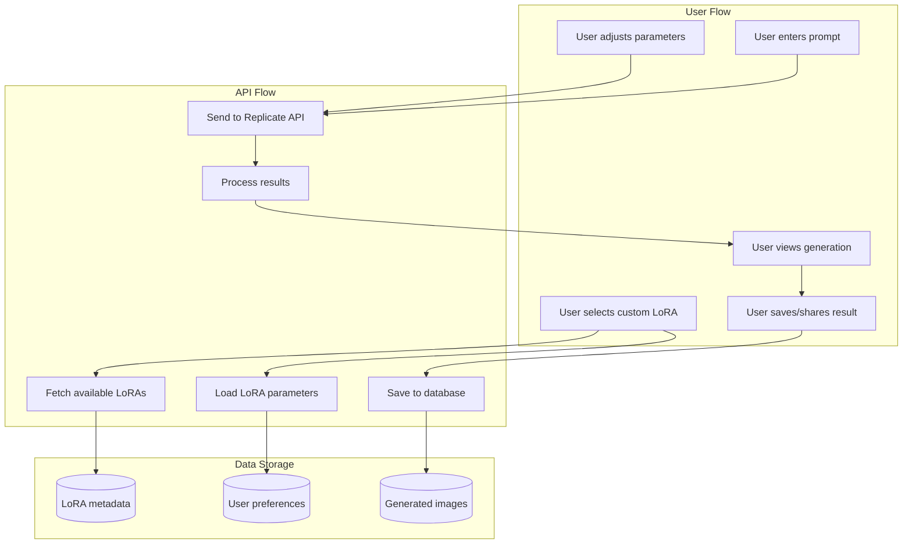

# PowerShift® Photo App Architecture Diagrams

## System Architecture

```mermaid
flowchart TD
    subgraph "Client"
        UI[UI Components]
        Pages[Page Components]
        Context[Context Providers]
        Hooks[Custom Hooks]
    end

    subgraph "Next.js Server"
        API[API Routes]
        MW[Middleware]
        SC[Server Components]
    end

    subgraph "External Services"
        Supabase[(Supabase Database)]
        Auth[Supabase Auth]
        Replicate[Replicate API]
    end

    UI --> Pages
    Pages --> SC
    Pages --> API
    Context --> Pages
    Hooks --> Pages
    Hooks --> UI

    API --> Supabase
    API --> Replicate
    API --> Auth
    MW --> Auth
    SC --> Supabase
    
    Supabase <--> Auth
```

## Authentication Flow

```mermaid
sequenceDiagram
    actor User
    participant Client
    participant API as Next.js API
    participant Auth as Supabase Auth
    participant DB as Supabase DB

    User->>Client: Enter credentials
    Client->>Auth: Sign In request
    Auth-->>Client: Return access token
    Client->>Client: Store token
    
    User->>Client: Request protected resource
    Client->>API: Request with Bearer token
    API->>Auth: Verify token
    Auth-->>API: Token valid + user data
    API->>DB: Query with user context
    DB-->>API: Return authorized data
    API-->>Client: Return resource
    Client-->>User: Display resource
```

## Data Flow - Image Generation

```mermaid
sequenceDiagram
    actor User
    participant UI as UI
    participant API as Next.js API
    participant Replicate as Replicate API
    participant Supabase as Supabase DB

    User->>UI: Enter prompt, select LoRA
    UI->>API: POST /api/generate
    API->>Replicate: POST generation request
    Note right of Replicate: Model processes image
    Replicate-->>API: Return image URL
    API-->>UI: Return generation result
    UI-->>User: Display generated image
    
    User->>UI: Save image
    UI->>API: POST /api/images
    API->>Supabase: Insert image record
    API->>Supabase: Insert favorite record
    Supabase-->>API: Confirm save
    API-->>UI: Confirm success
    UI-->>User: Show success message
```

## Database Schema

```mermaid
erDiagram
    PROFILES {
        uuid id PK
        string username
        timestamp created_at
        timestamp updated_at
    }
    
    IMAGES {
        uuid id PK
        uuid owner_id FK
        string image_url
        string title
        string description
        string prompt
        jsonb model_parameters
        boolean is_public
        timestamp created_at
        timestamp updated_at
    }
    
    FAVORITES {
        int id PK
        uuid profile_id FK
        uuid image_id FK
        timestamp created_at
    }
    
    LORA_MODELS {
        uuid id PK
        string replicate_id
        string name
        string owner
        string version
        string description
        boolean is_active
        jsonb default_parameters
        timestamp created_at
        timestamp updated_at
    }
    
    USER_LORA_ACCESS {
        uuid id PK
        uuid profile_id FK
        uuid lora_id FK
        boolean is_owner
        boolean can_use
        jsonb custom_parameters
        timestamp created_at
        timestamp updated_at
    }
    
    PROFILES ||--o{ IMAGES : "creates"
    PROFILES ||--o{ FAVORITES : "saves"
    IMAGES ||--o{ FAVORITES : "saved in"
    PROFILES ||--o{ USER_LORA_ACCESS : "has access to"
    LORA_MODELS ||--o{ USER_LORA_ACCESS : "accessible by"
    LORA_MODELS ||--o{ IMAGES : "used to create"
```

## Planned Functionality - Custom LoRA Flow

```mermaid
flowchart TD
    subgraph "User Flow"
        A[User selects custom LoRA]
        B[User adjusts parameters]
        C[User enters prompt]
        D[User views generation]
        E[User saves/shares result]
    end
    
    subgraph "API Flow"
        F[Fetch available LoRAs]
        G[Load LoRA parameters]
        H[Send to Replicate API]
        I[Process results]
        J[Save to database]
    end
    
    subgraph "Data Storage"
        K[(LoRA metadata)]
        L[(User preferences)]
        M[(Generated images)]
    end
    
    A --> F
    F --> K
    A --> G
    G --> L
    B --> H
    C --> H
    H --> I
    I --> D
    D --> E
    E --> J
    J --> M
``` 